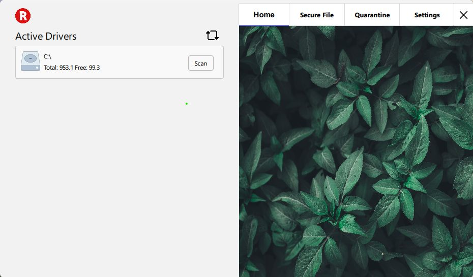
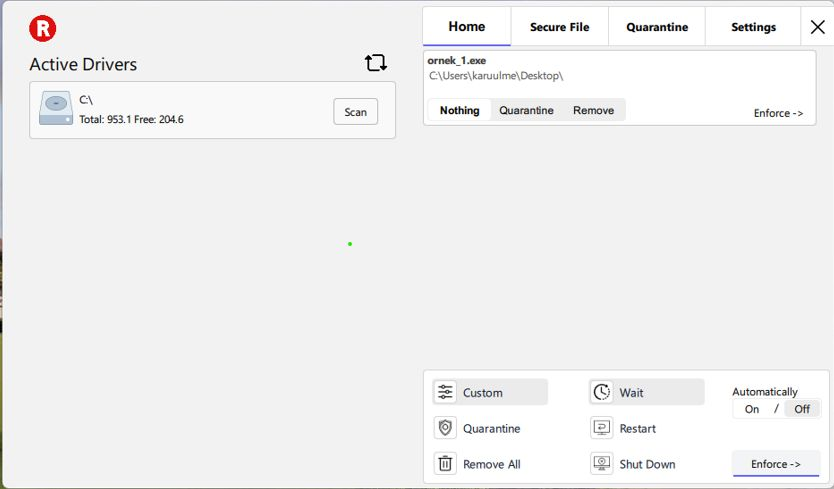
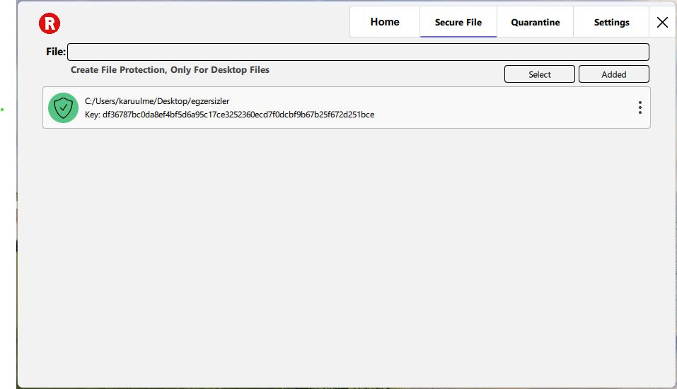
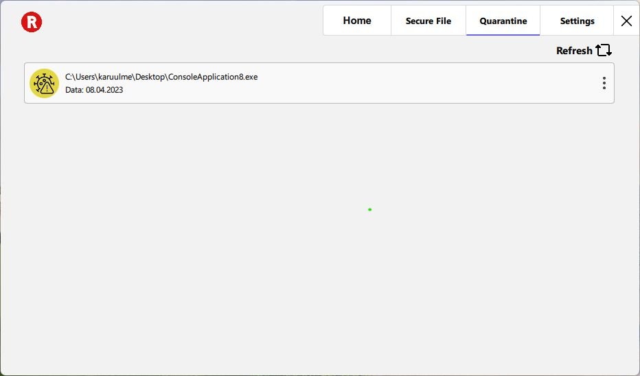
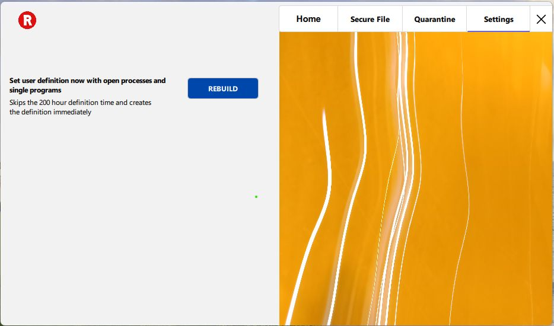

# Antivirus

Tarama yada ayarlardan kullanıcı tanımını çalıştırmak için `mele/main.py` dosyasını çalıştırmanız gerekmektedir.

Önce `Anitivirüs.exe` sonra `main.py` dosyası çalıştırılmalıdır.

**Ne yapıyor ?**

- Açılan işlemlerin bildirimlerini alması.
- Dll enjeksiyon yaparak kancalama yapar ve kancaya takılanlar program ile haberleşir (Tüm dosya ilişkili fonskyonlara hook atılmadı, sadece deneysel amaçlıdır). Amaç güvenli dosya olarak tanımlanan klasörlere girişi engellemek.
- Kayıt defterine veri tutması.
- Karantinaya alma yada çıkartma (şifreli), karantina tarihi ve adresi.
- Takılı diskleri listelemesi ve istenilen diski taraması.
- Taramanın bitmesi durumunda otomatik olarak tespitlere toplu karar verme seçeneği karantinaya al, sil yada hiç bir şey yapma, bilgisayarı kapatma, yeniden başlatma veya bekletme gibi seçeneklerde mevcut.
- Kayıt defterinde, açık işlemlerden kullanıcı tanımı oluşturması. Oluşturulan bu tanım programın davranışını değiştiriyor.

# **İNDİRMEK İÇİN**
[Buraya Tıklayınız](https://github.com/Karuulme/antivirus/releases/tag/2023.1.0) 

Makine öğreniminde kullanılan modül:

https://doi.org/10.3390/electronics12020342

# **GÖRSELLER**

 

